# Domain Model

<!-- Generated by the /domain-model skill from docs/specs/. Edit the specs, not this file. -->

Consolidated view of every entity across all feature specs. Each entity's authoritative
definition lives in its owning spec — follow the links for constraints and invariants.

## Diagram

```mermaid
erDiagram
    %% ---------- Persisted core (the only things stored) ----------
    Person ||--o{ TimeEntry : "owns"
    Project ||--o{ TimeEntry : "is booked to"
    Person ||--o{ Session : "has"
    Person }o--o{ Project : "assigned to"

    TimeEntry {
        UUID id PK
        UUID personId FK "required, immutable, set from the session"
        UUID projectId FK "required, active and assigned at save time"
        date date "required, never later than today"
        time beginTime "required, 00:00-23:59, wall clock"
        time endTime "required, 00:01-24:00, strictly after beginTime"
        datetime createdAt "generated, immutable"
        datetime updatedAt "generated, unused until story 005"
        integer duration "derived: endTime - beginTime in minutes, never stored"
    }

    Person {
        UUID id PK
        string fullName "required, 1-200 chars"
        string email UK "required, unique case-insensitive, max 254"
        string passwordHash "required, never exposed by any interface"
        enum role "required: User / Manager / Admin, default User"
        boolean isActive "required, default true"
        boolean mustChangePassword "required, default true on admin-set passwords"
        integer failedAttemptCount "required, >= 0, reset on successful sign-in"
        datetime lockedUntil "nullable, sign-in refused while in the future"
        datetime createdAt "generated, immutable"
        datetime deactivatedAt "nullable, cleared on reactivation"
    }

    Project {
        UUID id PK
        string name "required, not unique, what the type-ahead matches"
        string client "optional, label only, never an access boundary"
        boolean isActive "required, archived cannot be booked to but still reports"
        decimal budgetHours "optional, > 0 when set, lifetime envelope, story 010"
        date startDate "optional, reference line only"
        date endDate "optional, not before startDate"
    }

    Session {
        UUID personId FK "required"
        datetime signedInAt "required, immutable"
        datetime expiresAt "required, signedInAt + 12 hours, not extended by activity"
    }

    %% ---------- Reporting: the vocabulary of a query and its answer ----------
    ReportQuery ||--o{ TimeEntry : "selects"
    ReportQuery ||--|| DateRange : "value object"
    ReportQuery ||--|| TimeGranularity : "value object"
    ReportResult ||--|| ReportQuery : "answers"
    ReportResult ||--o{ ReportSlice : "partitions into"
    DateRange ||--o{ TimeBucket : "tiled into"
    ReportSlice |o--o| Project : "keyed by"
    ReportSlice |o--o| Person : "keyed by"
    ReportSlice |o--o| TimeBucket : "keyed by"

    ReportQuery {
        DateRange range "required"
        UUID personIds "set, empty means all the role permits, ignored for User"
        UUID projectIds "set, empty means all the role permits"
        enum dimension "required: Project / Person / Time, default Project, spec 013"
    }

    ReportResult {
        ReportQuery query "required, the question this answers"
        ReportSlice slices "list, ordered by minutes descending then label ascending"
        integer totalMinutes "required, >= 0, equals the sum of the slices"
    }

    ReportSlice {
        UUID key "project id or the Other marker; spec 013 widens to a bucket date"
        string label "required: project name, person full name, or bucket label"
        integer minutes "required, > 0; spec 013 permits 0 for the Time dimension"
    }

    DateRange {
        date begin "required"
        date end "required, not before begin, at most 365 days after it"
    }

    TimeGranularity {
        enum value "required: Day / Week / Month"
        boolean isExplicit "required, false means derived from the range length"
    }

    TimeBucket {
        date begin "required, within the report range"
        date end "required, within the range, not before begin"
        string label "required, unambiguous per spec 013 FR-014"
    }

    %% ---------- Drill-through ----------
    DrillQuery ||--|| ReportQuery : "narrows"
    DrillQuery ||--|| SliceKey : "value object"
    DrillQuery ||--|| DrillResult : "answered by"
    DrillResult ||--o{ TimeEntry : "lists"
    SliceKey |o--o| ReportSlice : "coordinate of"

    DrillQuery {
        ReportQuery query "required, inherited from the report unchanged"
        enum dimension "required"
        SliceKey slice "required, its dimension equals dimension"
        integer page "required, >= 1, default 1"
    }

    SliceKey {
        enum dimension "required, must match the dimension of its query"
        UUID value "project id, person id, bucket begin date, or the Other marker"
    }

    DrillResult {
        TimeEntry entries "list, at most one page of 200, ordered per FR-006"
        integer entryCount "required, >= 0, for the whole slice not the page"
        integer totalMinutes "required, >= 0, for the whole slice not the page"
    }

    %% ---------- Burn-down ----------
    Project ||--o| BurnDown : "consumption of"
    BurnDown ||--o{ BurnDownPoint : "plots"
    BurnDown ||--o| ConsumptionRate : "projects with"

    BurnDown {
        UUID projectId "required"
        date asOf "required, defaults to today, never in the future"
        integer budgetedMinutes "optional, > 0 when present, absent means no budget set"
        integer consumedMinutes "required, >= 0, lifetime to asOf, everyone"
        enum status "Healthy / Approaching / Critical / OverBudget, only when budgeted"
        decimal percentConsumed "derived: consumed / budgeted, unrounded for banding"
        integer remainingMinutes "derived: budgeted - consumed, may be negative"
    }

    BurnDownPoint {
        date date "required, between the first entry and asOf"
        integer cumulativeMinutes "required, >= 0, non-decreasing across the series"
    }

    ConsumptionRate {
        integer windowDays "required, fixed at 28"
        decimal minutesPerDay "required, >= 0, window total over 28 calendar days"
    }
```

**Notes on the diagram**

- Only `Person`, `Session`, `Project` and `TimeEntry` are persisted. Everything below the
  first cluster is a request-scoped value object: specs 012–015 introduce **no** stored
  entity, by their shared *nothing is stored* invariant.
- `Session` may be realised entirely as a signed cookie rather than a row
  ([spec 007](specs/007-authentication-and-roles.md), 5.1). `role` is deliberately absent
  from it — it is read from `Person` on every request.
- Four value objects are **not** separate tables and are therefore not drawn: `TimeRange`
  and `Duration` are `TimeEntry.beginTime`/`endTime` and their difference; `EmailAddress`
  and `Password` are `Person.email` and the plaintext behind `Person.passwordHash`.
- `ReportDimension` and `BudgetStatus` are single-valued enums, shown inline as
  `ReportQuery.dimension` / `SliceKey.dimension` / `BurnDown.status` rather than as
  one-column tables.
- A `ReportSlice` is keyed by exactly **one** of Project, Person or TimeBucket —
  whichever the query's dimension names. The three `|o--o|` edges are alternatives, not
  a conjunction.
- `Day` is not an entity: "Ann's 2026-09-15" is the set of TimeEntries matching a person
  and a date ([spec 001](specs/001-daily-time-entry.md), 5.2). Neither is `TimeBucket` —
  it is an interval generated from the range, which is why an empty one still exists.
- There is no `Budget` entity: a budget with no identity, no history and no
  sub-allocation is an attribute of `Project`
  ([spec 015](specs/015-project-burn-down.md), 5.2).

## Entities

| Entity | Owning spec | Description | Also referenced by |
| ------ | ----------- | ----------- | ------------------ |
| TimeEntry | [spec 001](specs/001-daily-time-entry.md) | A contiguous block of one person's day on one project — the atom every aggregate is derived from | [007](specs/007-authentication-and-roles.md), [012](specs/012-date-range-project-report.md), [013](specs/013-report-pivot-dimensions.md), [014](specs/014-chart-drill-through.md), [015](specs/015-project-burn-down.md) |
| Person | [spec 007](specs/007-authentication-and-roles.md) | A member of the organisation who signs in and owns time entries. Named *Person* because *User* is one of the three roles | [001](specs/001-daily-time-entry.md), [012](specs/012-date-range-project-report.md), [013](specs/013-report-pivot-dimensions.md), [014](specs/014-chart-drill-through.md), [015](specs/015-project-burn-down.md) |
| Session | [spec 007](specs/007-authentication-and-roles.md) | The conceptual record of a signed-in person; possibly a cookie rather than stored data | — |
| Project | **none yet** — stories 008 and 010 are not specced | The thing hours are booked to, and the holder of the budget envelope. Every attribute below is stated only by a *referencing* spec | [001](specs/001-daily-time-entry.md) (`id`, `name`, `isActive`), [012](specs/012-date-range-project-report.md) (+`client`), [014](specs/014-chart-drill-through.md) (`name`), [015](specs/015-project-burn-down.md) (+`budgetHours`, `startDate`, `endDate`) |

## Value Objects

| Value object | Owning spec | Belongs to | Description |
| ------------ | ----------- | ---------- | ----------- |
| TimeRange | [001](specs/001-daily-time-entry.md) | TimeEntry | The begin/end pair; carries the `end > begin` rule and the half-open `[begin, end)` overlap comparison. **Not a separate table** — two columns on TimeEntry |
| Duration | [001](specs/001-daily-time-entry.md) | TimeEntry | Minutes (1–1440) derived from a TimeRange, presented as decimal hours. **Never stored** |
| EmailAddress | [007](specs/007-authentication-and-roles.md) | Person | Max 254, syntactically valid, trimmed and lower-cased before comparison or storage. **Not a separate table** |
| Password | [007](specs/007-authentication-and-roles.md) | Person | Minimum 12 characters, no composition rules. Exists only in memory; stored solely as its hash |
| DateRange | [012](specs/012-date-range-project-report.md) | ReportQuery | Inclusive on both ends; at most 366 days inclusive (`end` ≤ `begin` + 365) |
| ReportQuery | [012](specs/012-date-range-project-report.md) | ReportResult, DrillQuery | The whole question — range, person filter, project filter, and (from 013) dimension. This is what the report address carries. **Not a permission** |
| ReportSlice | [012](specs/012-date-range-project-report.md), extended by [013](specs/013-report-pivot-dimensions.md) | ReportResult | One group of the partition: a key, a label and its minutes |
| ReportResult | [012](specs/012-date-range-project-report.md) | — | The answer: the query, its ordered slices, and the grand total |
| ReportDimension | [013](specs/013-report-pivot-dimensions.md) | ReportQuery, SliceKey | Enum `[Project, Person, Time]`, default Project; Person is unavailable to the User role. Shown inline in the diagram |
| TimeGranularity | [013](specs/013-report-pivot-dimensions.md) | ReportQuery | `[Day, Week, Month]` plus `isExplicit`; automatic from range length unless overridden, and carried in the address either way |
| TimeBucket | [013](specs/013-report-pivot-dimensions.md) | ReportResult (Time dimension) | A contiguous interval of the range. Buckets tile the range exactly; edge buckets may be partial |
| SliceKey | [014](specs/014-chart-drill-through.md) | DrillQuery | The coordinate of one slice — dimension plus a project id, person id, bucket begin date or the *Other* marker. Identity, never label |
| DrillQuery | [014](specs/014-chart-drill-through.md) | — | A ReportQuery plus a SliceKey plus a page. What the drill address carries. **Not a permission** |
| DrillResult | [014](specs/014-chart-drill-through.md) | — | One page of entries, plus the count and total for the **whole** slice |
| BurnDown | [015](specs/015-project-burn-down.md) | Project | The complete answer for one project as at one date. `percentConsumed`, `remainingMinutes` and `status` are all derived |
| BudgetStatus | [015](specs/015-project-burn-down.md) | BurnDown | Enum `[Healthy, Approaching, Critical, OverBudget]` at the fixed bands 75% / 90% / 100%, derived from the **unrounded** percentage. Shown inline in the diagram |
| BurnDownPoint | [015](specs/015-project-burn-down.md) | BurnDown | One point on the cumulative curve; non-decreasing across the series |
| ConsumptionRate | [015](specs/015-project-burn-down.md) | BurnDown | The fixed 28-calendar-day window behind the exhaustion projection |

## Cross-Spec Invariants

Rules that span more than one spec, or that constrain a relationship rather than a single
entity. Single-spec rules stay in their spec.

- **Totals are derived, nothing is stored.** No daily total, report aggregate, drilled
  total, consumed figure, percentage or status is persisted anywhere. Stated by 001
  (*totals are derived*), carried into 012 (*nothing is stored*), 013, 014 and 015
  (*everything is derived*). This is the single most load-bearing rule in the model, and
  it is why `TimeEntry` is the only table any aggregate reads.
- **Rounding happens once, at the end.** Minutes are summed as integers and converted to
  decimal hours only for presentation; a total is never the sum of rounded hours
  (001 `Duration`, 012 *rounding happens once*). Every `minutes`/`Minutes` attribute in
  the diagram exists because of this rule.
- **Immutable ownership.** `TimeEntry.personId` is set from the session at creation and
  never reassigned — a Manager editing someone's entry changes its content, never its
  owner (001 5.4, 007 5.4).
- **Deactivate and archive, never delete.** A `Person` is never removed and hours logged
  by leavers or to archived projects stay in every report and burn-down forever
  (007 FR-016, 012 FR-017, 015 *archiving and deactivation do not release hours*).
  `Project.isActive` and `Person.isActive` gate *booking* and *sign-in*, never
  *accounting*.
- **Scope is re-derived server-side on every request.** Neither `ReportQuery` nor
  `DrillQuery` is a permission; the viewer's role is applied on top of the address every
  time, so a shared link is a question and not a grant (007 *server-side enforcement*,
  012 FR-019, 013 FR-018, 014 FR-008, 015 NFR-006).
- **Aggregates reconcile with their parts, across features.** The slices sum to the grand
  total (012), the total is identical under all three dimensions and all granularities
  (013), the drilled total equals the slice figure it was opened from (014), and the
  consumed figure equals its drilled entries and its per-person breakdown (015 NFR-004).
  A disagreement means an entry was dropped or double-counted, and **both** figures are
  wrong.
- **Slices are keyed by identity, never by label.** Two projects or two people sharing a
  name remain two slices, and a rename never misdirects a shared drill link (013 5.4,
  014 *the key is identity*). This is why `Project.name` needs no uniqueness constraint.
- **Roles are global — with exactly one narrowing exception.** 007's *roles are global*
  invariant says project assignment confers no capability; 015 FR-018 makes assignment a
  *visibility* rule for the burn-down alone. The exception only ever grants a User less
  than a Manager, and 015 Section 9.2 flags it as the crack to watch in the
  `Person }o--o{ Project` relationship.
- **Aggregate visibility does not imply detail visibility.** A User may see that a project
  consumed 310.00 hours without being permitted to see whose hours those are (015 FR-018
  / FR-020, and 014 NFR-006: the drilled view exposes no attribute of a Person beyond
  their full name).
- **Hours only — no money anywhere.** There is no rate, cost, revenue or currency in the
  model, so no figure in any report or burn-down can be denominated in money
  (012 1.3, 015 1.3).
- **Zero is absent, except where zero is the finding.** A project or person with no hours
  is not a slice (012); a `TimeBucket` with no hours *is* one (013 FR-010). This is the
  one place a later spec deliberately relaxes an earlier rule, and the widened
  `ReportSlice.minutes` constraint is its only trace in the model.
- **No hour is booked twice.** Per person per date, no two `TimeEntry` ranges intersect
  (001). 014 EC-17 treats a violation as unreachable by construction and names the drill
  as the screen that would expose it, so reporting depends on this invariant rather than
  restating it.

## Open Questions

1. **`Project` has no owning spec.** Stories 008 (projects) and 010 (budgets) are not
   specced, yet four specs read the entity and three state partial attribute tables for
   it. The diagram's `Project` is the union of what
   [001](specs/001-daily-time-entry.md) (5.1), [012](specs/012-date-range-project-report.md)
   (5.1) and [015](specs/015-project-burn-down.md) (5.1) *rely on* — no spec is the
   authority for enforcing any of it. Writing spec 008 should start from this row and is
   free to contradict it.
2. **`ReportSlice.key` has three different types across three specs.**
   [012](specs/012-date-range-project-report.md) declares `UUID` while its own
   description already admits the *Other* marker;
   [013](specs/013-report-pivot-dimensions.md) widens it to "UUID or date";
   [014](specs/014-chart-drill-through.md)'s `SliceKey.value` states all three. The
   diagram carries the owning spec's `UUID` per the merge rule, which is narrower than
   what 013 and 014 require. 012's Section 5.3 should be amended to the widened form.
3. **`ReportSlice.minutes` is `> 0` in 012 and `>= 0` in 013.** 013 declares the
   relaxation deliberately (an empty Time bucket is the finding), so this is a documented
   override rather than a contradiction — but the two specs state opposite constraints on
   the same attribute, and 012's table does not mention it.
4. **`Project.budgetHours` is `decimal` hours while `BurnDown.budgetedMinutes` is
   `integer` minutes.** Every other quantity in the model is integer minutes converted
   once for presentation. No spec states how a decimal budget becomes minutes, so a
   budget of `0.005` hours is unrepresentable and rounding at that boundary is undefined.
   Story 010 should either model the budget in minutes or state the conversion.
5. **`TimeEntry.note` is referenced but defined nowhere.**
   [014](specs/014-chart-drill-through.md) FR-004 and 5.1 read a `note` attribute "once
   story 003 adds it"; story 003 is not specced, so the attribute is absent from the
   diagram. [001](specs/001-daily-time-entry.md) 9.1 warns explicitly that `TimeEntry` is
   not a closed entity.
6. **The `Person`–`Project` assignment (story 009) has no owner, no attributes and no
   stated cardinality.** Three specs read it — 001 as a booking rule, 015 as a visibility
   rule — and none defines it. The diagram uses the looser `}o--o{`: 001 EC-10 confirms a
   person may be assigned to no projects; nothing states whether a project may have no
   people, or whether an assignment carries its own attributes (a date, a rate — the
   latter would collide with *hours only*).
7. **`TimeEntry.updatedAt` is stored but unused.** 001 5.1 reserves it for story 005
   while entries are create-only. It is in the diagram because the owning spec states it,
   not because anything reads it.
8. **The story map still uses the pre-spec vocabulary.** 007 renamed the map's *user* to
   `Person` (because *User* is a role) and 013 renamed the map's *per day* dimension to
   *Time*. Both specs recommend reconciling `docs/product/story-map.md`; it has not been
   done, so map and model disagree on two names.
